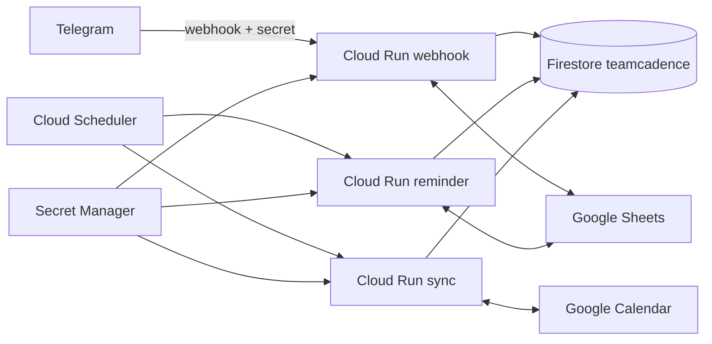

# TeamCadence: перенос AWS → GCP

## Целевая схема



Все три Cloud Run сервиса запускают один и тот же образ. Переменная
`SERVICE_MODE` включает только нужный endpoint. Scheduler-сервисы закрыты IAM,
а публичный Telegram webhook проверяет `X-Telegram-Bot-Api-Secret-Token`.

## Что переносится без изменения

- bot `@FoqusTeamBot` и его Telegram ID;
- группа `HostAI: Dream team` и topics `board`, `work`, `calls`;
- команды, callback-кнопки, мемы, плановые пуши и StandUP-статусы;
- Google Sheet Tracker-HostAI и Google Calendar;
- все записи DynamoDB: tenants, users, settings, tasks, reminders, events и aura.

Firestore сохраняет исходную модель `PK/SK` без преобразования:

```text
partitions/{base64(PK)}/items/{base64(SK)}
```

## Порядок развертывания

1. Подготовить GCP ресурсы:

   ```bash
   ./deploy/gcp-bootstrap.sh
   ```

2. Добавить версии трёх Secret Manager secrets, не сохраняя значения в Git:

   - `teamcadence-bot-token`;
   - `teamcadence-google-sa-json`;
   - `teamcadence-webhook-secret`.

3. Экспортировать DynamoDB и импортировать Firestore:

   ```bash
   python scripts/export_aws_state.py
   python scripts/import_firestore_state.py --delete-extra
   python scripts/verify_firestore_state.py
   ```

4. Собрать образ и развернуть Cloud Run:

   ```bash
   ./deploy/gcp-deploy.sh
   ./deploy/gcp-scheduler.sh
   ```

   Scheduler jobs после создания остаются `PAUSED`.

5. Проверить `/health`, подписанный тестовый webhook, ручной запуск обоих
   Scheduler jobs и Cloud Logging.

6. Непосредственно перед переключением повторить экспорт, импорт и сверку, чтобы
   забрать изменения, появившиеся во время подготовки.

7. Переключить production:

   ```bash
   CONFIRM_CUTOVER=teamcadence ./deploy/cutover-to-gcp.sh
   ```

   Скрипт выключает два AWS EventBridge rules, меняет Telegram webhook и только
   затем включает два GCP Scheduler jobs.

## Проверка после переключения

- `getWebhookInfo` показывает URL `teamcadence-webhook` и ноль ошибок;
- `/new` создаёт задачу в Sheet и возвращает её текст с кнопкой «Открыть трекер»;
- callback статуса меняет Sheet и соответствующее напоминание;
- тестовый календарный event появляется один раз, без дублей;
- Scheduler executions имеют HTTP 2xx, а Cloud Run logs не содержат traceback;
- количество и содержимое Firestore items совпадают с финальным AWS snapshot.

## Откат

AWS ресурсы при миграции не удаляются. Для отката:

```bash
CONFIRM_ROLLBACK=teamcadence ./deploy/rollback-to-aws.sh
```

Скрипт останавливает GCP Scheduler, возвращает Telegram webhook на API Gateway и
снова включает EventBridge. После стабилизации отдельно синхронизируются записи,
которые успели появиться в Firestore.
